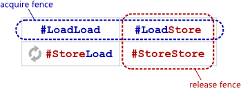
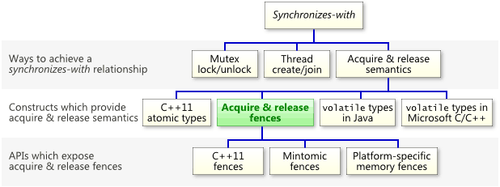
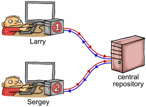

# [Acquire and Release Fences](https://preshing.com/20130922/acquire-and-release-fences/)

- [Acquire and Release Fences](#acquire-and-release-fences)
  - [They Can Establish `Synchronizes-With` Relationships](#they-can-establish-synchronizes-with-relationships)
  - [A Walkthrough Using Acquire and Release Fences](#a-walkthrough-using-acquire-and-release-fences)
  - [The C++11 Standard's Got Our Back](#the-c11-standards-got-our-back)

Acquire and release fences, in my opinion, are rather misunderstood on the web right now. That's too bad, because the C++11 Standards Committee did a great job specifying the meaning of these memory fences. They enable robust algorithms which scale well across multiple cores, and map nicely onto today's most common CPU architectures.

First things first: **Acquire and release fences** are considered **low-level lock-free operations**. If you stick with higher-level, [sequentially consistent](http://preshing.com/20120612/an-introduction-to-lock-free-programming#sequential-consistency) atomic types, such as `volatile` variables in Java 5+, or default atomics in C++11, you don't need acquire and release fences. The tradeoff is that sequentially consistent types are slightly less scalable or performant for some algorithms.

On the other hand, if you've developed for multicore devices in the days before C++11, you might feel an affinity for acquire and release fences. Perhaps, like me, you remember struggling with the placement of some `lwsync` intrinsics while synchronizing threads on Xbox 360. What’s cool is that once you understand acquire and release fences, you actually see what we were trying to accomplish using those platform-specific fences all along.

Acquire and release fences, as you might imagine, are **standalone memory fences**, which means that they **aren't coupled with any particular memory operation**. So, how do they work?

- An **acquire fence** prevents the memory reordering of any **read** which precedes it in program order with any **read or write** which follows it in program order.

- A **release fence** prevents the memory reordering of any **read or write** which precedes it in program order with any **write** which follows it in program order.

In other words, in terms of the barrier types [explained here](http://preshing.com/20120710/memory-barriers-are-like-source-control-operations), an acquire fence serves as both a `#LoadLoad + #LoadStore` barrier, while a release fence functions as both a `#LoadStore + #StoreStore` barrier. That's all they purport to do.

When programming in C++11, you can invoke them using the following functions:

    #include <atomic>
    std::atomic_thread_fence(std::memory_order_acquire);
    std::atomic_thread_fence(std::memory_order_release);

In C11, they take this form:

    #include <stdatomic.h>
    atomic_thread_fence(memory_order_acquire);
    atomic_thread_fence(memory_order_release);

And using [Mintomic](http://mintomic.github.io/lock-free/memory-fences/), a small, portable lock-free API:

    #include <mintomic/mintomic.h>
    mint_thread_fence_acquire();
    mint_thread_fence_release();

On the SPARC-V9 architecture, an acquire fence can be implemented using the `membar #LoadLoad | #LoadStore` instruction, and an a release fence can be implemented as `membar #LoadStore | #StoreStore`. On other CPU architectures, the people who implement the above libaries must translate these operations into the next best thing – some CPU instruction which provides at least the required barrier types, and possibly more. On PowerPC, the next best thing is `lwsync`. On ARMv7, the next best thing is `dmb`. On Itanium, the next best thing is `mf`. And on x86/64, [no CPU instruction](http://preshing.com/20120930/weak-vs-strong-memory-models) is needed at all. As you might expect, acquire and release fences restrict reordering of neighboring operations [at compile time](http://preshing.com/20120625/memory-ordering-at-compile-time) as well.

## They Can Establish `Synchronizes-With` Relationships

The most important thing to know about acquire and release fences is that they can establish a [synchronizes-with](http://preshing.com/20130823/the-synchronizes-with-relation) relationship, which means that they prohibit memory reordering in a way that allows you to pass information reliably between threads. Keep in mind that, as the following chart illustrates, acquire and release fences are **just one of many constructs** which can establish a synchronizes-with relationship.

As I've [shown before](http://preshing.com/20120913/acquire-and-release-semantics), a relaxed [atomic](http://preshing.com/20130618/atomic-vs-non-atomic-operations/) load immediately followed by an acquire fence will convert that load into a **read-acquire**. Similarly, a relaxed atomic store immediately preceded by a release fence will convert that store into a **write-release**. For example, if `g_guard` has type `std::atomic<int>`, then this line

    g_guard.store(1, std::memory_order_release);

can be safely replaced with the following.

    std::atomic_thread_fence(std::memory_order_release);
    g_guard.store(1, std::memory_order_relaxed);

One precision: In the latter form, it is no longer the store which **synchronizes-with** anything. It is the fence itself. To see what I mean, let's walk through a detailed example.

## A Walkthrough Using Acquire and Release Fences

We'll take the example from my [previous post](http://preshing.com/20130823/the-synchronizes-with-relation/) and modify it to use C++11's standalone acquire and release fences. Here's the `SendTestMessage` function. The atomic write is now `relaxed`, and a release fence has been placed immediately before it.

    void SendTestMessage(void* param)
    {
        // Copy to shared memory using non-atomic stores.
        g_payload.tick  = clock();
        g_payload.str   = "TestMessage";
        g_payload.param = param;
        
        // Release fence.
        std::atomic_thread_fence(std::memory_order_release);

        // Perform an atomic write to indicate that the message is ready.
        g_guard.store(1, std::memory_order_relaxed);
    }

Here's the `TryReceiveMessage` function. The atomic read has been relaxed, and an acquire fence has been placed slightly after it. In this case, the fence does not occur immediately after the read; we first check whether `ready != 0`, since that's the only case where the fence is really needed.

    bool TryReceiveMessage(Message& result)
    {
        // Perform an atomic read to check whether the message is ready.
        int ready = g_guard.load(std::memory_order_relaxed);
        
        if (ready != 0)
        {
            // Acquire fence.
            std::atomic_thread_fence(std::memory_order_acquire);

            // Yes. Copy from shared memory using non-atomic loads.
            result.tick  = g_payload.tick;
            result.str   = g_payload.str;
            result.param = g_payload.param;
            
            return true;
        }
        
        // No.
        return false;
    }

Now, if `TryReceiveMessage` happens to see the write which `SendTestMessage` performed on `g_guard`, then it will issue the acquire fence, and the **synchronizes-with** relationship is complete. Again, strictly speaking, it’s the fences which **synchronize-with** each other.

Let's back up for a moment and consider this example in terms of the [source control analogy](http://preshing.com/20120710/memory-barriers-are-like-source-control-operations) I made a while back. Imagine shared memory as a central repository, with each thread having its own private copy of that repository. As each thread manipulates its private copy, modifications are constantly "leaking" to and from the central repository at unpredictable times. Acquire and release fences are used to enforce ordering among those leaks.

If we imagine Thread 1 as a programmer named Larry, and Thread 2 as a programmer named Sergey, what happens is the following:

1. Larry performs a bunch of **non-atomic** stores to his private copy of `g_payload`.

2. Larry issues a release fence. That means that all his previous memory operations will be committed to the repository – whenever that happens – before any store he performs next.

3. Larry stores `1` to his private copy of `g_guard`.

4. At some random moment thereafter, Larry's private copy of `g_guard` leaks to the central repository, entirely on its own. Remember, once this happens, we're guaranteed that Larry's changes to `g_payload` are in the central repository, too.

5. At some random moment thereafter, the updated value of `g_guard` leaks from the central repository to Sergey's private copy, entirely on its own.

6. Sergey checks his private copy of `g_guard` and sees `1`.

7. Seeing that, Sergey issues an acquire fence. All the contents of Sergey's private copy become at least as new as his previous load. This completes the **synchronizes-with** relationship.

8. Sergey performs a bunch of **non-atomic** loads from his private copy of `g_payload`. At this point, he is guaranteed to see the values that were written by Larry.

Note that the guard variable must "leak" from Larry's private workspace over to Sergey's all by itself. When you think about it, acquire and release fences are just a way to piggyback additional data on top of such leaks.

## The C++11 Standard's Got Our Back

The C++11 standard explicitly states that this example will work on any compliant implementation of the library and language. The promise is made in §29.8.2 of [working draft N3337](http://www.open-std.org/jtc1/sc22/wg21/docs/papers/2012/n3337.pdf):

> A release fence A **synchronizes with** an acquire fence B if there exist atomic operations X and Y, both operating on some atomic object M, such that A is **sequenced before** X, X modifies M, Y is **sequenced before** B, and Y reads the value written by X or a value written by any side effect in the hypothetical release sequence X would head if it were a release operation.

That's a lot of letters. Let’s break it down. In the above example:

- Release fence A is the release fence issued in `SendTestMessage`.

- Atomic operation X is the relaxed atomic store performed in `SendTestMessage`.

- Atomic object M is the guard variable, `g_guard`.

- Atomic operation Y is the relaxed atomic load performed in `TryReceiveMessage`.

- Acquire fence B is the acquire fence issued in `TryReceiveMessage`.

And finally, if the relaxed atomic load reads the value written by the relaxed atomic store, the C++11 standard says that the fences synchronize-with each other, just as I've shown.

I like C++11's approach to portable memory fences. Other people have attempted to design portable memory fence APIs in the past, but in my opinion, few of them hit the sweet spot for lock-free programming like C++11, as far as standalone fences go. And while acquire and release fences may not translate directly into native CPU instructions, they're close enough that you can still squeeze out as much performance as is currently possible from the vast majority of multicore devices. That's why Mintomic, an open source library I released earlier this year, offers [acquire and release fences](http://mintomic.github.io/lock-free/memory-fences/) – along with a consume and full memory fence – as its only memory ordering operations. [Here's](https://gist.github.com/preshing/6663087) the example from this post, rewritten using Mintomic.

In an upcoming post, I’ll highlight a couple of misconceptions about acquire & release fences which are currently floating around the web, and discuss some performance concerns. I’ll also talk a little bit more about their relationship with read-acquire and write-release operations, including some consequences of that relationship which tend to trip people up.
