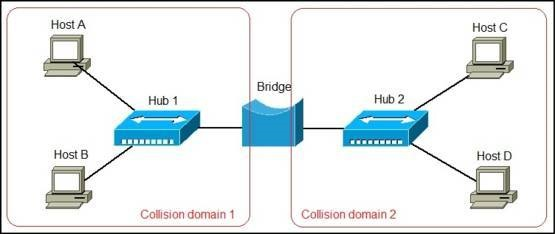

# [What is a network bridge?](https://geek-university.com/ccna/what-is-a-network-bridge/)

- [What is a network bridge?](#what-is-a-network-bridge)

A network bridge is a device that divides a network into **segments**. Each segment represent a separate **collision domain**, so the number of collisions on the network is reduced. Each collision domain has its own separate bandwidth, so a bridge also improves the network performance.

A bridge works at the Data link layer (Layer 2) of the OSI model. It inspects incoming traffic and decide whether to forward it or filter it. Each incoming Ethernet frame is inspected for destination MAC address. If the bridge determines that the destination host is on another segment of the network, it forwards the frame to that segment.

Consider the following example network:

In the picture above we have a network of four computers. The network is divided into segments by a bridge. Each segment is a separate collision domain with its own bandwidth. Let’s say that Host A wants to communicate with Host C. Host A will send the frame with the Host C’s destination MAC address to the bridge. The bridge will inspect the frame and forward it to the segment of the network Host C is on.

Network bridges offer substantial improvements over network hubs, but they are **not widely used anymore in modern LANs**. Switches are commonly used instead.
