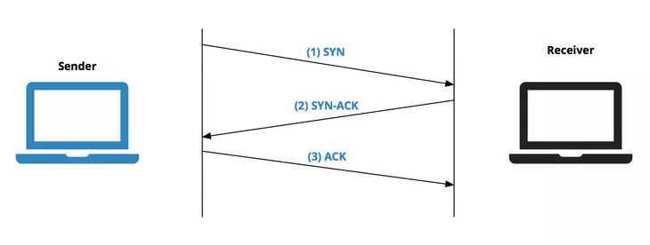

# [TCP Flags](https://www.keycdn.com/support/tcp-flags)

- [TCP Flags](#tcp-flags)
  - [What are TCP flags?](#what-are-tcp-flags)
  - [List of TCP flags](#list-of-tcp-flags)
    - [`SYN`](#syn)
    - [`ACK`](#ack)
    - [`FIN`](#fin)
    - [`URG`](#urg)
    - [`PSH`](#psh)
    - [`RST`](#rst)
    - [`ECE`](#ece)
    - [`CWR`](#cwr)
    - [`NS` (experimental)](#ns-experimental)
  - [Analyzing TCP flags in the CLI](#analyzing-tcp-flags-in-the-cli)
  - [Summary](#summary)

## What are TCP flags?

TCP flags are used within TCP packet transfers to indicate a particular connection state or provide additional information. Therefore, they can be used for troubleshooting purposes or to control how a particular connection is handled. There are a few TCP flags that are much more commonly used than others as such `SYN`, `ACK`, and `FIN`. However, in this post, we're going to go through the full list of TCP flags and outline what each one is used for.

## List of TCP flags

Each TCP flag corresponds to 1 bit in size. The list below describes each flag in greater detail. Additionally, check out the corresponding RFC section attributed to certain flags for a more comprehensive explanation.

### `SYN`

The synchronisation flag is used as a **first step in establishing a three way handshake** between two hosts. **Only the first packet from both the sender and receiver should have this flag set**. The following diagram illustrates a three way handshake process.

### `ACK`

The acknowledgment flag is used to acknowledge the successful receipt of a packet. As we can see from the diagram above, the receiver sends an `ACK` as well as a `SYN` in the **second step of the three way handshake** process to tell the sender that it received its initial packet.

### `FIN`

The finished flag means there is no more data from the sender. Therefore, it is used in the **last packet sent from the sender**.

### `URG`

The urgent flag is used to notify the receiver to process the urgent packets before processing all other packets. The receiver will be notified when all known urgent data has been received. See [RFC 6093](https://tools.ietf.org/html/rfc6093) for more details.

### `PSH`

The push flag is somewhat similar to the URG flag and tells the receiver to process these packets as they are received instead of buffering them.

### `RST`

The reset flag gets sent from the receiver to the sender when a packet is sent to a particular host that was not expecting it.

### `ECE`

This flag is responsible for indicating if the TCP peer is [ECN](https://en.wikipedia.org/wiki/Explicit_Congestion_Notification) capable. See [RFC 3168](https://tools.ietf.org/html/rfc3168) for more details.

### `CWR`

The congestion window reduced flag is used by the sending host to indicate it received a packet with the ECE flag set. See RFC 3168 for more details.

### `NS` (experimental)

The nonce sum flag is still an experimental flag used to help protect against accidental malicious concealment of packets from the sender. See RFC 3540 for more details.

## Analyzing TCP flags in the CLI

You can view which TCP flags are being used for every TCP packet directly from within your command line interface. To do so, you need to run a `tcpdump`. This needs to be done by a root user so if you don't have root access, try running the following:

    sudo tcpdump

This will allow you to analyze all packets being sent and will display packets containing **any of the TCP flags**. However, if you would like to run a `tcpdump` only on packets containing a certain flag you can use one of the following commands.

- `ACK`
  
      sudo tcpdump 'tcp[13] & 16 != 0'

- `SYN`

      sudo tcpdump 'tcp[13] & 2 != 0'

- `FIN`

      sudo tcpdump 'tcp[13] & 1 != 0'

- `URG`
  
      sudo tcpdump 'tcp[13] & 32 != 0'

- `PSH`

      sudo tcpdump 'tcp[13] & 8 != 0'

- `RST`

      sudo tcpdump 'tcp[13] & 4 != 0'

## Summary

Knowing your TCP flags can be quite useful for troubleshooting purposes. If you need to quickly analyze your TCP packets, it's easy to run a `tcpdump` command for a particular flag and then retrieve the results you require. Be sure to check out the RFC section of any of the corresponding TCP flags above to go into even greater detail of what each one is used for and how it works.
