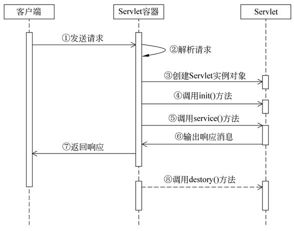

# [Servlet入门教程](http://c.biancheng.net/servlet/)

- [Servlet入门教程](#servlet入门教程)
  - [Java Servlet是什么？它有哪些特点？](#java-servlet是什么它有哪些特点)
  - [与Servlet相关的接口和类](#与servlet相关的接口和类)
  - [|||](#)
  - [|||](#-1)
  - [第一个Servlet程序](#第一个servlet程序)
  - [Servlet生命周期详解](#servlet生命周期详解)
  - [Servlet配置虚拟路径映射](#servlet配置虚拟路径映射)
    - [Servlet的多重映射](#servlet的多重映射)

Servlet 是 Server Applet 的简称，译为“服务器端小程序”。Servlet 是 Java 的一套技术标准，规定了如何使用 Java 来开发动态网站。换句话说，Java 可以用来开发网站后台，但是要提前定义好一套规范，并编写基础类库，这就是 Servlet 所做的事情。

Java Servlet 可以使用所有的 Java API，Java 能做的事情，Servlet 都能做。

这套 Servlet 入门教程对 Servlet 技术的整体框架进行了讲解，并附带了实例演示，阅读本教程需要具备 [Java 基础](http://c.biancheng.net/java/)。

Servlet 只是古老的 CGI 技术的替代品，直接使用 Servlet 开发还是很麻烦，所以 Java 后来又对 Servlet 进行了升级，推出了 [JSP 技术](http://c.biancheng.net/jsp/)。JSP 只是对 Servlet 加了一层壳，JSP 经过编译后还是 Servlet。

## [Java Servlet是什么？它有哪些特点？](http://c.biancheng.net/view/3980.html)

Servlet（Server Applet）是 Java Servlet 的简称，是使用 Java 语言编写的运行在服务器端的程序。具有独立于平台和协议的特性，主要功能在于交互式地浏览和生成数据，生成动态Web内容。

通常来说，Servlet 是指所有实现了 Servlet 接口的类。

Servlet 主要用于处理客户端传来的 HTTP 请求，并返回一个响应，它能够处理的请求有 doGet() 和 doPost() 等。

Servlet 由 Servlet 容器提供，Servlet 容器是指提供了 Servlet 功能的服务器（如 Tomcat）。

Servlet 容器会将 Servlet 动态加载到服务器上，然后通过 HTTP 请求和 HTTP 应与客户端进行交互。

Servlet 应用程序的体系结构如图 1 所示。

图 1  Servlet 应用程序的体系结构

在图 1 中，Servlet 的请求首先会被 HTTP 服务器（如 Apache）接收，**HTTP 服务器只负责静态 HTML 页面的解析**，而 Servlet 的请求会转交给 **Servlet 容器**，Servlet 容器会根据 web.xml 文件中的映射关系，调用相应的 Servlet，Servlet 再将处理的结果返回给 Servlet 容器，并通过 HTTP 服务器将响应传输给客户端。

Servlet 技术具有如下特点。

1. 方便

   Servlet 提供了大量的实用工具例程，如处理很难完成的 HTML 表单数据、读取和设置 HTTP 头，以及处理 Cookie 和跟踪会话等。

2. 跨平台

   Servlet 使用 Java 类编写，可以在不同的操作系统平台和不同的应用服务器平台运行。

3. 灵活性和可扩展性强

   采用 Servlet 开发的 Web 应用程序，由于 Java 类的继承性及构造函数等特点，使得应用灵活，可随意扩展。

除了上述几点以外，Servlet 还具有功能强大、能够在各个程序之间共享数据、安全性强等特点，此处不再详细说明，读者简单了解即可。

## [与Servlet相关的接口和类](http://c.biancheng.net/view/3982.html)

Sun 公司提供了一系列的接口和类用于 Servlet 技术的开发，其中最重要的接口是 javax.servlet.Servlet。在 Servlet 接口中定义了 5 个抽象方法，如表 1 所示。

---
表 1 Servlet接口的抽象方法

|||
|-|-|
方法声明|功能描述
void init(ServletConfig config)|容器在创建好 Servlet 对象后，就会调用此方法。该方法接收一个 ServletConfig 类型的参数，Servlet 容器通过该参数向 Servlet 传递初始化配置信息
ServletConfig getSendetConfig()|用于获取 Servlet 对象的配置信息，返回 Servlet 的 ServletConfig 对象
String getServletInfo()|返回一个字符串，其中包含关于 Servlet 的信息，如作者、版本和版权等信息
void service (ServletRequest request,ServletResponse response)|负责响应用户的请求，当容器接收到客户端访问 Servlet 对象的请求时，就会调用此方法。  容器会构造一个表示客户端请求信息的 ServletRequest 对象和一个用于响应客户端的 ServletResponse 对象作为参数传递给 service() 方法。   在 service() 方法中，可以通过 ServletRequest 对象得到客户端的相关信息和请求信息，在对请求进行处理后，调用 ServletResponse 对象的方法设置响应信息
void destroy()|负责释放 Servlet 对象占用的资源。当服务器关闭或者 Servlet 对象被移除时，Servlet 对象会被销毁，容器会调用此方法
|||
---

在表 1 中，列举了 Servlet 接口中的五个方法，其中 init()、service() 和 destroy() 方法可以表现 Servlet 的生命周期，它们会在某个特定的时刻被调用。

针对 Servlet 的接口，Sun 公司提供了两个默认的接口实现类：GenericServlet 和 HttpServlet。其中，GenericServlet 是一个抽象类，该类为 Servlet 接口提供了部分实现，它并没有实现 HTTP 请求处理。

HttpServlet 是 GenericServlet 的子类，它继承了 GenericServlet 的所有方法，并且为 HTTP 请求中的 GET 和 POST 等类型提供了具体的操作方法。通常情况下，编写的 Servlet 类都继承自 HttpServlet，在开发中使用的也是 HttpServlet 对象。

HttpServlet 类中包含两个常用方法，这两个方法的说明如表 2 所示。

---
表 2 HttpServlet 类的常用方法

|||
|-|-|
方法声明|功能描述
protected void doGet (HttpServletRequest req, HttpServletResponse resp)|用于处理 GET 类型的 HTTP 请求的方法
protected void doPost(HttpServletRequest req, HttpServletResponse resp)|用于处理 POST 类型的 HTTP 请求的方法
|||
---

HttpServlet 主要有两大功能，具体如下。

- 根据用户请求方式的不同，定义相应的 doXxx() 方法处理用户请求。例如，与 GET 请求方式对应的 doGet() 方法，与 POST 方式对应的 doPost() 方法。
- 通过 service() 方法将 HTTP 请求和响应分别强转为 HttpServletRequest 和 HttpServletResponse 类型的对象。

需要注意的是，由于 HttpServlet 类在重写的 service() 方法中，为每一种 HTTP 请求方式都定义了对应的 doXxx() 方法，因此，当定义的类继承 HttpServlet 后，只需要根据请求方式重写对应的 doXxx() 方法即可，而不需要重写 service() 方法。

## [第一个Servlet程序](http://c.biancheng.net/view/3985.html)

...

## [Servlet生命周期详解](http://c.biancheng.net/view/3989.html)

在 Java 中，任何对象都有生命周期，Servlet 也不例外。Servlet 的生命周期如图 1 所示。

---

图 1 描述了 Servlet 的生命周期。按照功能的不同，大致可以将 Servlet 的生命周期分为三个阶段，分别是初始化阶段、运行阶段和销毁阶段。

---

1. 初始化阶段

   当客户端向 Servlet 容器发出 HTTP 请求要求访问 Servlet 时，**Servlet 容器首先会解析请求**，检查内存中是否已经有了该 Servlet 对象，如果有，则直接使用该 Servlet 对象，如果没有，则创建 Servlet 实例对象，然后通过调用 init() 方法实现 Servlet 的初始化工作。需要注意的是，**在 Servlet 的整个生命周期内，它的 init() 方法只能被调用一次**。

2. 运行阶段

   这是 Servlet 生命周期中最重要的阶段，在这个阶段中，**Servlet 容器**会为这个请求**创建**代表 HTTP 请求的 **ServletRequest 对象**和代表 HTTP 响应的 **ServletResponse 对象**，然后将它们作为参数**传递给 Servlet 的 service() 方法**。

   service() 方法从 ServletRequest 对象中获得客户请求信息并处理该请求，通过 ServletResponse 对象生成响应结果。

   在 Servlet 的整个生命周期内，对于 Servlet 的每一次访问请求，Servlet 容器都会调用一次 Servlet 的 service() 方法，并且创建新的 ServletRequest 和 ServletResponse 对象，也就是说，**service() 方法在 Servlet 的整个生命周期中会被调用多次**。

3. 销毁阶段

   当服务器关闭或 Web 应用被移除出容器时，Servlet 随着 Web 应用的关闭而销毁。在销毁 Servlet 之前，Servlet 容器会调用 Servlet 的 destroy() 方法，以便让 Servlet 对象释放它所占用的资源。**在 Servlet 的整个生命周期中，destroy() 方法也只能被调用一次**。

需要注意的是，Servlet 对象一旦创建就会驻留在内存中等待客户端的访问，直到**服务器关闭**或 **Web 应用被移除出容器**时，Servlet 对象才会销毁。

## [Servlet配置虚拟路径映射](http://c.biancheng.net/view/3996.html)

在 web.xml 文件中，一个 `<servlert-mapping>` 元素用于映射一个 **Servlet 的对外访问路径**，该路径也称为虚拟路径。例如，在《[第一个Servlet程序](http://c.biancheng.net/view/3985.html)》教程中，TestServlet01 所映射的虚拟路径为“/TestServlet01”。

创建好的 Servlet 只有映射成虚拟路径，客户端才能对其进行访问。但是在映射 Servlet 时，还有内容需要学习，如 Servlet 的多重映射、在映射路径中使用通配符、配置默认的 Servlet 等。本节将对这些内容进行讲解。

### Servlet的多重映射

TODO java servlet