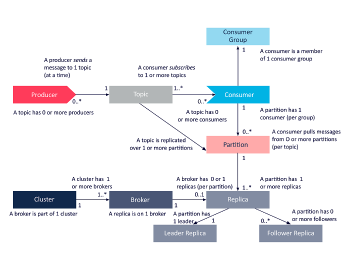
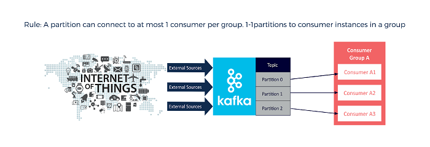
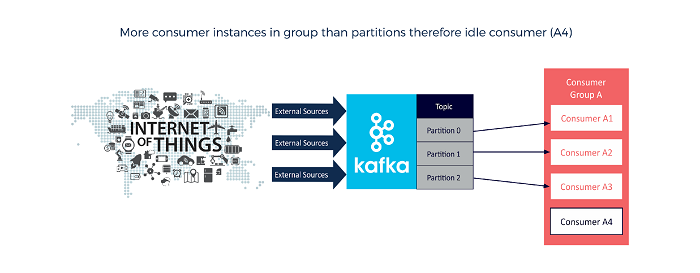
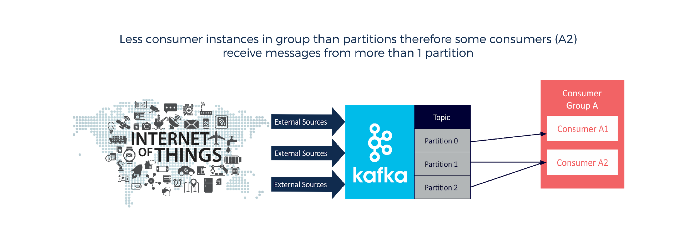
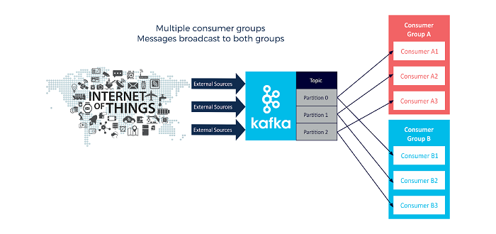

# [Developing a Deeper Understanding of Apache Kafka Architecture](https://insidebigdata.com/2018/04/12/developing-deeper-understanding-apache-kafka-architecture/)

- [Developing a Deeper Understanding of Apache Kafka Architecture](#developing-a-deeper-understanding-of-apache-kafka-architecture)
  - [The Kafka Components – Universal Modeling Language (UML)](#the-kafka-components--universal-modeling-language-uml)
  - [Consumers Rule](#consumers-rule)

## The Kafka Components – Universal Modeling Language (UML)

Kafka’s main architectural components include Producers, Topics, Consumers, Consumer Groups, Clusters, Brokers, Partitions, Replicas, Leaders, and Followers. This simplified UML diagram describes the ways these components relate to one another:

It’s important to note the relationships between broker, replica, and partition components that are highlighted, such as:

- Kafka clusters can have one or more brokers.

- Brokers can host multiple replicas.

- Topics can have one or more partitions.

- A broker can host zero or one replica per partition.

- A partition has one leader replica and zero or more follower replicas.

- Each replica for a partition needs to be on a separate broker.

- Every partition replica needs to fit on a broker, and a partition can’t be divided over multiple brokers.

- Every broker can have one or more leaders, covering different partitions and topics.

Let’s have a closer-look example of the the relationship between producers, topics, and consumers:

In this diagram, producers send to single topics:

Notice here that consumers – such as Consumer 3 in the above diagram – can be simultaneously subscribed to multiple topics and will therefore receive messages from those topics in a single poll. Received messages can be checked and filtered by topic if necessary.

In this example, a producer sends to multiple topics:

While producers can only message to one topic at a time, they’re able to send messages asynchronously. Using this technique allows a producer to functionally send multiple messages to multiple topics at once.

Because Kafka is designed for broker scalability and performance, producers (rather than brokers) are responsible for choosing **which partition each message is sent to**.  The default partition is determined by a hashing function on the message key, or round-robin in the absence of a key. However, this may not always provide the desired behaviour (e.g. message ordering, fair distribution of messages to consumers, etc). Producers can therefore send messages to specific partitions – through the use of a custom partitioner, or by using manual or hashing options available with the default partitioner.

## Consumers Rule

A fundamental explanation of Kafka’s inner workings goes as follows: Every topic is associated with one or more partitions, which are spread over one or more brokers. Every partition gets replicated to those one or more brokers depending on the **replication factor** that is set. The replication factor is then responsible for determining the **reliability**, while the **number of partitions** is responsible for the **parallelism** for consumers. **A partition is associated with only a single consumer instance per consumer group**. Since **the total consumer instances per group is less than – or the same as – the number of partitions**, adding support for extra consumer instances requires that more partitions be added as well, but ensures read scalability.

Because of this, events in a partition have an order to them. **Within a consumer group, each event will only be processed by a single consumer**. At the same time, when multiple consumer groups subscribe to a topic and have a consumer in each, every consumer will receive every message that is **broadcast**.

The examples below demonstrate various ways in which a single topic with multiple partitions, consumers, and consumer groups can be utilized.

Here, the same number of partitions and consumers within one group are used:

Normally, a partition can only support a single consumer in a group. This limit can be overcome, however, by **manually** connecting consumers to a specific partition in a topic, effectively overruling the dynamic protocol for those consumers. Such consumers should be in different groups. This has no effect on consumers that still connect **dynamically**:

Another scenario is to have a more consumers in a group than partitions, with certain consumers remaining idle. Kafka is able to **failover** to such idle consumers in cases where an active consumer dies, or when a new partition is added:

In this next example there are fewer consumers in a group that partitions, causing consumer A2 to be responsible for processing more messages than consumer A1:

Finally, this last example includes multiple consumer groups, with the result that every event from each partition gets broadcast to each group:

The Kafka protocol will dynamically perform the work of maintaining a consumer’s membership in its group. Any new instances that join the group will **automatically** take over partitions from other group members. And, any instances that die will have their partitions reassigned among the instances that persist.

In understanding Kafka consumers from an architectural and resourcing standpoint, it’s critical to note that consumers and producers don’t run on Kafka brokers, but they do they require CPU and IO resources of their own. This is advantageous in offering the flexibility to run consumers however, wherever, and in whatever quantity is needed without concern for deployment to brokers or sharing their resources. However, a challenge remains in that the best method for deploying and resourcing consumers and producers must be thoroughly thought out. An optimal strategy might be to enlist scalable and elastic microservices for the task.
